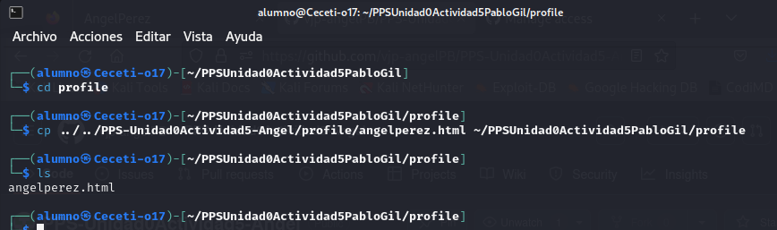

# PPS-Unidad0Actividad5-Angel
## Actividad 5 - Unidad 0 Uso de Git (III)

## Creación del repositorio

## Viendo los remotos
Con `git remote -v` podemos ver los repositorios remotos que tenemos configurados.

1. Mira tus remotos.
   

# Visualizando la página web

1. Visualiza con php el contenido de la página web(`php -S 0:8080`).

(No aparece nada)

2. Introduce dentro de la carpeta img una imagen de tu foto o avatar. El nombre del archivo debe de llevar como nombre tu nombre.

3. Dentro de la carpeta profile crea un archivo html con el mismo nombre del archivo de la imagen que copiaste en el punto anterior.

4. Lanza el comando php para que se muestre el contenido de la página web y ver cómo se ha modificado.

## Colaborando
Podemos añadir colaboradores en nuestro proyecto desde la Configuración del Repositorio, apartado Collaborators. Éstos podrán realizar cambios en él.

1. Comparte tu proyecto con al menos dos compañeros.

3. Para cada uno de los proyectos de tus compañeros:
  * Acepta la invitación de colaboración en su repositorio.
 
  
  
  

  * Clona el repositorio (Recuerda que tendrás que crear una carpeta nueva para él).
 
  
  
  

  * Añade una nueva rama con tu nombre y cámbiate a la rama que has creado
  
  
  
  

  * Comprueba en que rama te encuentras (`git status` te dá la información).
 
  
 
  

  * Añade en esa rama tus archivos de usuario (foto y profile).
  
  
  
  
  
  
 
  
  
  * Sube los cambios de tu rama al repositorio remoto y comprueba que puedes verlos en la web.
 
  
 
  

   

 
Ahora vamos a hacer modificaciones en la rama main de tus compañeros. Es importante que el tiempo entre el push y el pull sea pequeño, ya que si en ese tiempo hay modificaciones por parte de otro colaborador, es posible que haya inconsistencias, en cuyo caso tendremos que utilizar `git merge`.

1. Cambiate a la rama main de los proyectos de tus compañeros

2. Añade en ella tus archivos de usuario (foto y profile).

3. Sube los cambios a la rama main de los repositorios de tus compañeros.

4. Vuelve a tu repositorio.

5. Comprueba en qué rama te encuentras.

6. Comprueba que tus compañeros hayan creado sus ramas en tu repositorio (`git branch`). Si no es así...!!!! échales una mano, hombre¡¡¡¡¡

7. Comprueba con `git diff` las diferencias existentes entre las ramas Main y las de tus compañeros

## Erre que erre con Git Logs

1. Muestra los logs

`git log`

2. Muestra los logs de los últimos 3 commits
`git log -n 3`

3. Muestra los logs utilizando el modificador --pretty
`git log --pretty=oneline`

5. Muestra los logs de los últimos 2 commits donde se vean las diferencias de cada una de las entradas.
`git log -n 2 -p`

7. Muestra los logs de las modificaciones realizadas en el último día
`git log --since="1 day ago"`

